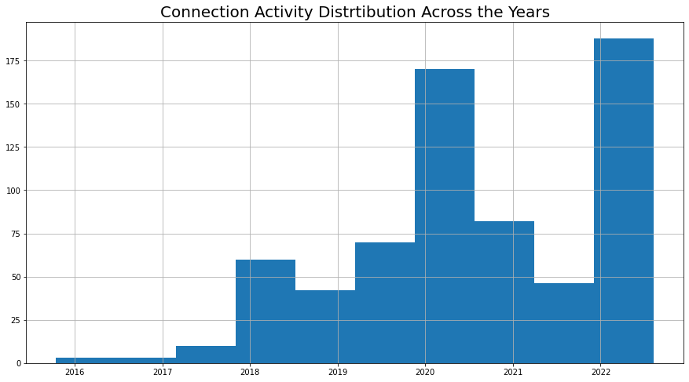

# This is an Ananlysis Carried out on my LinkedIn Profile Connections.

**Date of Data Collection:** 11th August, 2022 at 08:43hr (WAT)

**Data Source:** https://www.linkedin.com/

## Summary:

The data was gotten directly from my LinkedIn account on the above mentioned date. The .csv file downloaded had a shape of (723, 6) implying that at the time of data collection, I had a total of 723 connections. After data cleaning, I enged working with only 674 of my connections.

I used the NetworkX Python package to create the network graph and the Pyvis network to the graph and make it interactive.

## Conclusion:

**Insight 1:** 9 of my connections have no names. This is strange. 

**Insight 2:** A good majority of my connections didn't include their email addresses on their profile. Not encouraged.

**Question:** How could there be connections with no names? Could those represent deleted accouunts?

**Insight 3:** I joined LinkedIn in 2015. This was first year in Covenant University. I believe it had something to do with the inspirational people I met in the Technical Crew service Unit.

**Insight 4:** First spike of connection activity in 2018. This should be because I was trying to get an internship ooportunity around that time.

**Insight 5:** Second spike of connection activity in 2020. Convocation and job search.

**Insight 6:** Third spike of connection activity, 2022. Job search and connection to learn more and add value to myself and those I connect with.

**Insight 7:** Most of my connections are from Covenant University. Makes sense as I spent 5 years of my life interacting wth these people and that community was a major force for my joining and being active on LinkedIn.

**Insight 8:** Most of my connections are interns. I should work on that.

## Data Features:

- First Name: This is the first name of the connection.
- Last Name: This is the last name of the connection.
- Email Address: This is the email address of the connection.
- Company: This is the company of the connection as at the time of data collection.
- Position: This is the position occupied by the connection as at the time of data collection.
- Connected On: This is the date I connected with the individual.

### Acknowledgement:

- I would like to acknowledge the medium [article](https://medium.com/bitgrit-data-science-publication/visualize-your-linkedin-network-with-python-59a213786c4) that inspired this project.

- I would also like to acknowledge "Thu Vu data analytics". It was while watching this YouTube [video](https://www.youtube.com/watch?v=nNfco7k7Hi0
) that I saw the above mentioned article. 

**My LinkedIn Profile:** [Urias, Triumph](https://www.linkedin.com/in/triumph-urias-4812b8108/)